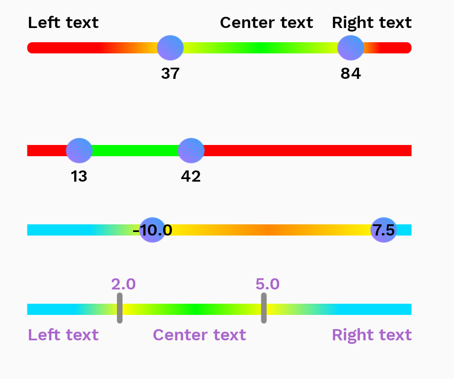
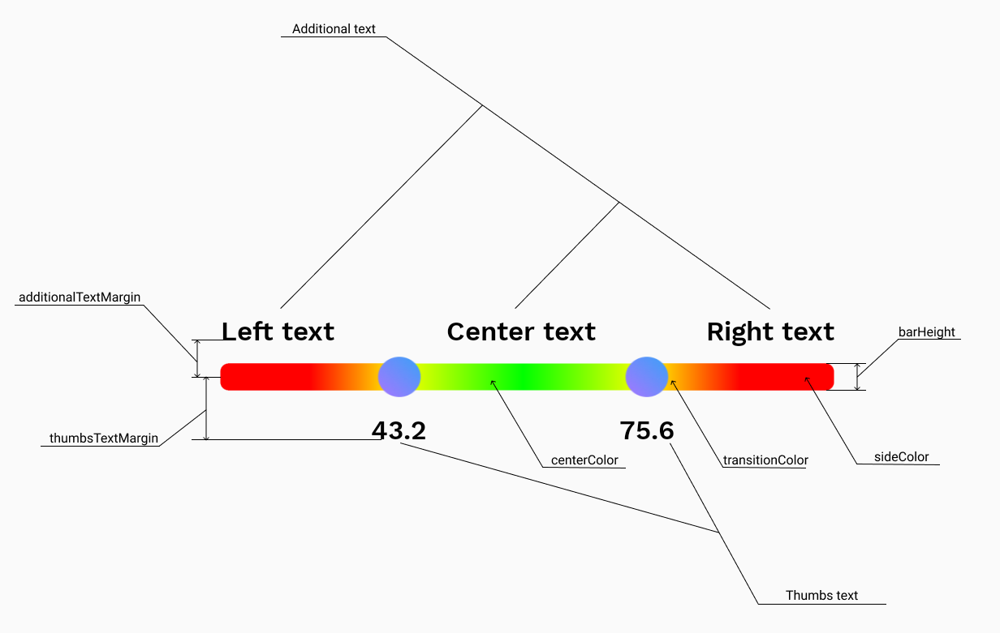

**Attributes**
                    
Attribute  | Type | Description | Default value
-----------|-------|-------------|-----------
minValue  | float | min value of range | 0f
maxValue  | float | max value of range | 100f
stepValue | float | it must be: (maxValue - minValue) % stepValue == 0f | 1f
valueType | intType, floatType | to display values in the form you want | intType
enableGradient | boolean | enable or disable gradient between center and sides | false
textColor | color | change all text color on view | Color.GRAY
showThumbsText | none, below, above, center | numeric values of selected range | none
thumbsTextMargin | dimension  | margin from center of seekbar(сan be negative) | 0dp
additionalTextMargin | dimension | margin from center of seekBar(сan be negative) | 0dp
showAdditionalText | none, below, above, center | additional info on seekbar(left, center and right text)  | none
roundedCorners | boolean | seekbar with rounded corners or not | false
barHeight | dimension | height of bar(**possible problems with large values**) | 8dp
active | boolean | enable or disable seekbar, if seekbar disabled thumb images will be replaced by others (thumbsDisabled) | true
textSize | dimension | change all text size on view | 12sp
textFont | not ready yeat | - | worksans-semibold
centerText | string | - | Center text
rightText | string | - | Right text
leftText | string | - | Left Text
thumbsNormal | drawable | - | thumb_normal.png
thumbsPressed | drawable | - | thumb_pressed.png
thumbsDisabled | drawable | - | thumb_disabled.png
sideColor | color | colors left and right of thumbs | Color.RED
transitionColor | color | color used in gradient formation, if *enableGradient* = false, this color not used | Color.YELLOW
centerColor | color | color between left and right thumbs | Color.GREEN

**Functions**

Function name | Description |
---------------- | ------------------------------ |
`setRange(minValue: Float, maxValue: Float, stepValue: Float)`      | set range values with valueType = float       |
`setRange(minValue: Int, maxValue: Int, stepValue: Int)`   | set range values with valueType = int     |
`setCurrentValues(leftValue: Float, rightValue: Float)` | set selected values
`setCurrentValues(leftValue: Int, rightValue: Int)` | set selected values
`getRangeInfo()` | return RangeInfo(val minValue: Float, val maxValue: Float, val stepValue: Float)
`getCurrentValues()` | return Range(val leftValue: Float, val rightValue: Float)

**Public fields(getters and setters)**

Field name: type | Attribute equivalent |
------------- | ------------- |
isActive: Boolean | active
leftText: String | leftText
rightText: String | rightText
centerText: String | centerText
sideBarColor: Int | sideColor
centerBarColor: Int | centerColor
transitionBarColor: Int | transitionColor
isGradientNeed: Int | enableGradient

**Interfaces**

Field name | Type | Description |
-------------| ------| -------------|
listenerPost | OnRangeSeekBarPostListener | sends results after a user has finished changing them.
listenerRealTime | OnRangeSeekBarRealTimeListener | sends results while changing values
